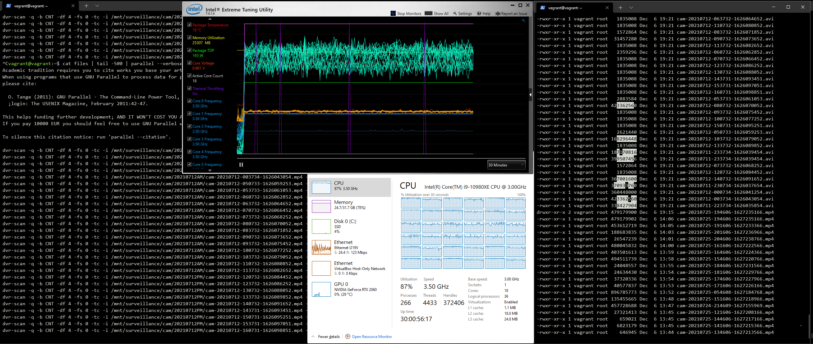

# batch-motion-detector

## A Vagrant box to batch-process surveillance video



The main purpose is to **keep** the **motion-detected parts** only and then **get rid** of the **original files**, reclaiming much **storage space**.

For each video file:
  extract a new video file that contains frames where motion is detected.

Than you can remove the original video files.

1. It use **dvr-scan** for motion detection and video production;
1. than use **ffmpeg** to encode the video using x264;
1. the original file basename is kept.

Usage example
```
> vagrant up
> vagrant ssh
$ sudo mkdir /mnt/surveillance
$ sudo mount -t cifs \
-o uid=vagrant,username=<username> \
//<ip>/surveillance /mnt/surveillance

$ sudo mkdir /mnt/surveillance/motion

$ find /mnt/surveillance/cam \
-type 'f' -name '*.mp4' | sort -V | uniq | \
parallel --verbose -j 28 --ungroup \
dvr-scan -q -b CNT -df 4 -fs 0 -tc -i {} \
-o /mnt/surveillance/motion/{/.}.avi

$ find /mnt/surveillance/motion \
-type 'f' -name '*.avi' | sort -V | uniq | \
parallel --verbose -j 3 --ungroup \
ffmpeg -loglevel quiet -y -i {} \
-c:v libx264 -c:a \
copy /mnt/surveillance/motion/{/.}.mp4
```
